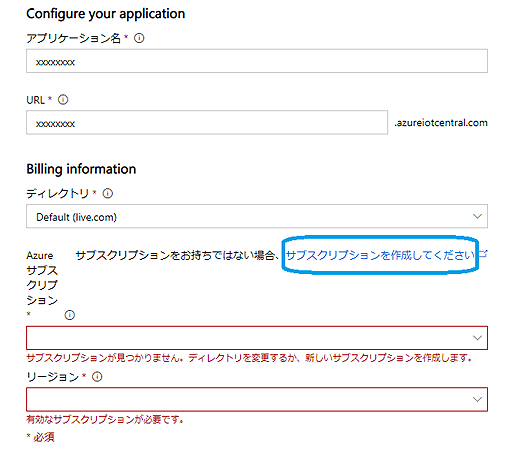
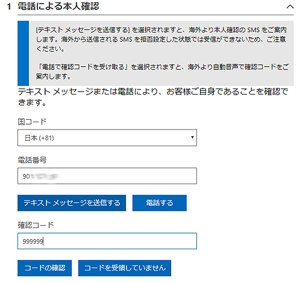
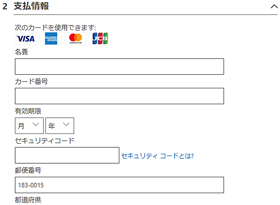
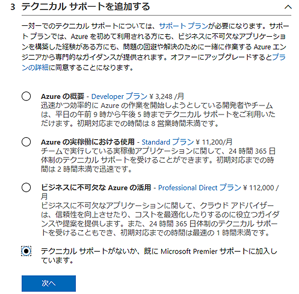
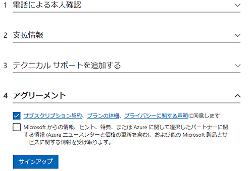
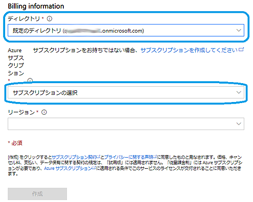

# azure-subscription

### Azure IoT Central 専用 Azure サブスクリプション作成方法

## はじめに

[**Azure IoT Central**](https://azure.microsoft.com/ja-jp/services/iot-central/) は、多くの使い易い機能を持った、**5台** までのデバイスであれば無期限で無料で使えるというお得なIoT用の統合サービスです。しかしこれを試すためには、Azure サブスクリプション（Subscription) という課金用アカウントが必要です。ここでは、この Azure サブスクリプションの取得手順を簡単に説明します。

Azure サブスクリプション開設では、個人用電話番号とクレジットカード情報を使用して本人確認を行います。これは、[Azure 無料アカウント取得手順](http://www.devdrv.co.jp/hidaka/node/65
) と基本的に同じ方式です。Azure 無料アカウントと違う点は、無料期間の期限がない点です。すでに使用中の Microsoftアカウントで無料アカウント開設済でなおかつ後述のディレクトリ（Azure アクティブディレクトリ）が有効であれば、それに紐づけ済のAzure サブスクリプションが選択できるため、この手順によるアカウント作成は不要です。

## 必要なもの
- 有効な Microsoft アカウント
- 本人確認用のSMSまたは音声通話が着信できる電話番号
- 有効なクレジットカード

## 注意点
- この手順をスムーズに行うためには、Azure Portalには **ログインせず** に、必ず [**Azure IoT Central**](https://azure.microsoft.com/ja-jp/services/iot-central/) に作成済の Microsoft アカウントでログインしてから始めて下さい。
- 5台までのデバイスが期限なしで無料利用できるのは、**従量課金制 (Pay-As-You-Go)** を選択した場合だけです。**評価版 (Trial)** で始めた場合はサブスクリプションが不要ですが、7日以内にアプリケーションを廃棄するか、従量課金に移行する必要があります。 
- Microsoft アカウントが過去に何らかの Azure サブスクリプションを持っていた場合は、自動的にそれが割り当てられる場合があります。
- 作成した、あるいは既存のサブスクリプションは、**5. サブスクリプションの設定** のディレクトリと紐付けられます。プルダウンメニューでディレクトリ名に表示される **Default (`live.com`)** を変更して確認して下さい。
- 5台までのデバイスであれば無料で利用できるのは、IoT Centralの基本サービスだけです。他の有償サービスと合わせて利用する際は、ぞれぞれの使用量に応じた課金が適用されますので、ご注意ください。

## 説明

[Azure IoT Central の入り口ページ](
https://apps.azureiotcentral.com/) にMicrosoft アカウントでログインします。**新しいアプリケーション** を作成する下記画面の途中で、**サブスクリプションを作成してください** をクリックすると、そのまま次の Azure サブスクリプション 作成画面が表示されます。

### 1．電話による本人確認
用意してある電話番号を入力して「テキストメッセージ（SMS）」または「電話する（音声案内）」のいずれかの方法で、受け取った確認コードを入力します。同一電話番号で一つのサブスクリプションしか作成できないため、すでにあるサブスクリプションで使用済の番号は利用できません。

以降の手順では、Microsoft アカウントに設定してある住所や電話番号がデフォルトで表示されます。従って必要であればこの場で、あるいは Microsoft アカウントの方の設定を変更ます。

### 2. 支払い情報
有効なクレジットカード情報を入力します。

### 3.テクニカルサポートを追加する
テクニカルサポートの選択設定です。ここで有償のサポートを選択すると、以降毎月サポート料金がかかるので、必要なければ一番下のテクニカルサポートが不要を選択します。

### 4.アグリーメント
最低限、**同意します** のチェックが必要です。**サインアップ** をクリックして完了します。

### 5. サブスクリプションの設定
正しくサブスクリプションが作成されると、ディレクトリの欄でMicrosoft アカウントに紐づけされた **既定のディレクトリ（Azure Active Directory 名）** が選択できるようになるので、これを選択します。その後サブスクリプションの選択で、今回作成された **従量課金(Pay-As-You-Go)** を選択します。

© 2019 Atomu Hidaka All rights reserved.

 この資料は <a rel="license" href="http://creativecommons.org/licenses/by/4.0/">クリエイティブ・コモンズ 表示 4.0 国際 ライセンス</a> の下で提供されています。
