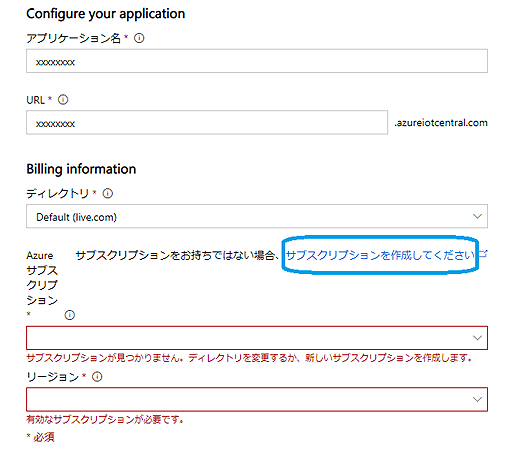
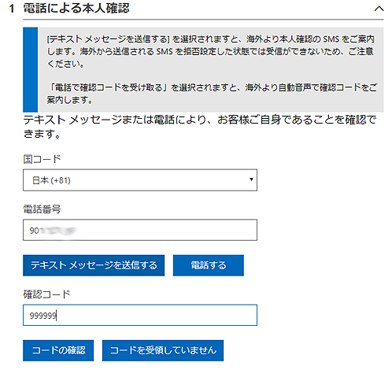
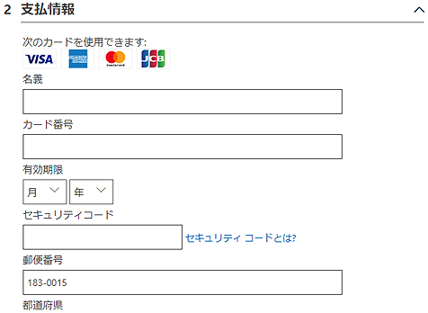
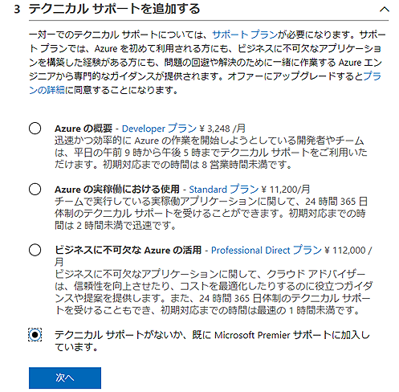
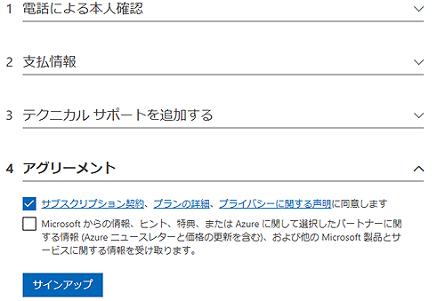
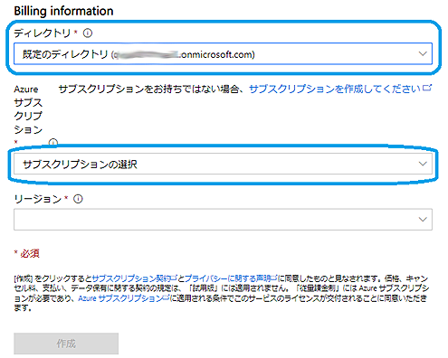

# azure-subscription

Azure IoT Central 用 Azure サブスクリプション作成方法

## はじめに

[**Azure IoT Central**](https://azure.microsoft.com/ja-jp/services/iot-central/) は、多くの使い易い機能を持った、5台までのデバイスであれば無料で使えるというお得なIoT用サービスである。しかしこれを試すためには、Azure サブスクリプション（Subscription) という課金用アカウントが必要だ。ここでは、この Azure サブスクリプションの取得手順を簡単に説明する。

Azure サブスクリプションの開設の考え方は、個人用電話番号とクレジットカード情報を使用して本人確認を行うという、[Azure 無料アカウント取得手順](http://www.devdrv.co.jp/hidaka/node/65
)と基本的には同じ。無料アカウントと違う点は、無料期間の有効期限がない点である。すでに使用中の Microsoftアカウントで無料アカウント開設済であれば、そこで登録したAzure サブスクリプションが選択できるため、この手順によるアカウント作成は不要である。

## 必要なもの
- 有効な Microsoft アカウント
- 本人確認用のSMSまたは音声通話が着信できる電話番号
- 有効なクレジットカード

## 説明

[Azure IoT Central の入り口ページ](
https://apps.azureiotcentral.com/) にMicrosoft アカウントでログインして、**新しいアプリケーション** を作成する下記画面の途中で、**サブスクリプションを作成してください** をクリックすると、そのまま Azure サブスクリプション 作成画面が表示される。

### 1．電話による本人確認
用意してある電話番号を入力して、受け取った確認コードを入力する。同一電話番号で一つのサブスクリプションしか作成できないため、すでにあるサブスクリプションで使用済の番号は利用できない。

以降の手順では、Microsoft アカウントに設定してある住所や電話番号がデフォルトで表示される。従って必要であればこの場で、あるいは Microsoft アカウントの方の設定を変更する。

### 2. 支払い情報
有効なクレジットカード情報を入力する。

### 3.テクニカルサポートを追加する
テクニカルサポートの選択設定。ここで有償のサポートを選択すると、以降毎月サポート料金がかかるので、必要なければ一番下のテクニカルサポートが不要を選択する。

### 4.アグリーメント
最低限、**同意します** のチェックが必要。**サインアップ** をクリックして完了。

### 5. サブスクリプションの設定
正しくサブスクリプションが作成されると、ディレクトリの欄でMicrosoft アカウントに紐づけされた **既定のディレクトリ（Azure Active Directory 名）** が選択できるようになるので、これを選択する。その後サブスクリプションの選択で、今回作成された **従量課金(Pay-As-You-Go)** を選択する。

